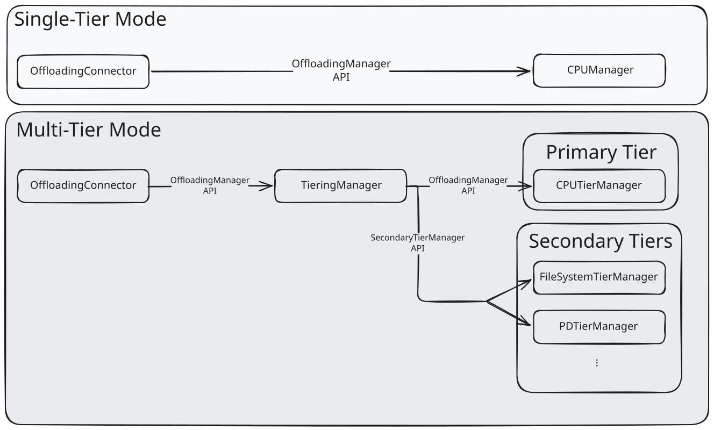

# Multi-Tier KV Offloading in vLLM

Based on:
[RFC]: Multi-tier KV offloading via the vLLM offloading connector
<https://github.com/vllm-project/vllm/issues/38260>

## Motivation

To date, vLLM offers native KV offloading to CPU memory but does not support further offloading from CPU memory to other tiers such as storage. Implementations for storage offload should either work directly with storage or implement their own CPU offloading as an additional tier. This document describes a high level design to natively support multi-tier KV offloading in vLLM.

The architecture supports a single primary tier, in most cases CPU DRAM, and multiple secondary tiers.

## Goals

- Allow simple and native integration of the current vLLM CPU offloading  with secondary tiers such as storage, or connection with other vLLM nodes for PD disaggregation settings or P2P communication of KV data.

- Utilize async gpu<->cpu transfers for primary tier and async lookup for secondary tier loads

- Support for HMA models out of the box

- Simple, clean and performant implementation of PD communication via  the CPU tier

What we don't intend to support

- Direct GPU access (neither GPU-storage or GPU-GPU communication)

- Limited flexibility for variance in block size. While we allow vLLM block size to vary, CPU block size must be constant across all vLLM nodes (and a multiple of the underlying vLLM block size).

## High Level Design

The design extends the existing offloading connector. In the single-tier mode, the `OffloadingConnector` uses the vLLM V1 connector API and translates it to a simpler `OffloadingManager` interface for the CPU backend. Multi-tier offloading introduces several key changes:

- **Primary + Secondary tier separation.** A single CPU DRAM backend serves as the primary tier. One or more additional backends serve as secondary tiers. Unlike the primary tier, secondary tiers transfer data to/from CPU memory, not GPU HBM.

- **TieringOffloadingManager as orchestrator.** A new `TieringOffloadingManager` implements the same `OffloadingManager` interface and coordinates all communication between the primary and secondary tiers. The `OffloadingConnector` is unaware whether it talks to a single-tier or multi-tier manager.

- **Split execution model.** GPU↔CPU offloading is **managed by the scheduler** but **executed by the worker** (the worker performs the actual DMA transfers). In contrast, all **secondary tier operations are both managed and executed on the scheduler side only**. They are lightweight async jobs that do not touch GPU memory.

## The TieringOffloadingManager

The native KV offloading in vLLM v1 currently supports offloading **from GPU memory** to an external location (like CPU memory). The multi-tier design extends this to allow offloading **from CPU memory** to additional tiers such as local storage, object storage, and remote nodes (P/D disaggregation).



The `OffloadingConnector` interface is unchanged. It holds a single `OffloadingManager`. The new `TieringOffloadingManager` implements that interface and orchestrates the tier hierarchy internally.

### Two Tier Types

**Primary Tier**: a single tier with exclusive access to GPU KV memory. The existing `CPUPrimaryTierOffloadingManager` (extending the CPU Manager) serves as the primary tier.

**Secondary Tier(s)**: one or more tiers with read/write access to the primary tier's CPU memory. No direct GPU access. Each secondary tier implements the `SecondaryTierManager` interface.

### SecondaryTierManager Interface

```python
class SecondaryTierManager(ABC):
    def __init__(
        offloading_spec: OffloadingSpec,
        primary_kv_view: memoryview,
        tier_type: str,
    ) -> None: ...

    def lookup(key: OffloadKey, req_context: ReqContext) -> LookupResult: ...
    def submit_store(job_metadata: JobMetadata) -> None: ...
    def submit_load(job_metadata: JobMetadata) -> None: ...
    def get_finished_jobs() -> Iterable[JobResult]: ...
```

```python
@dataclass
class JobMetadata:
    job_id: JobId                   # unique job identifier
    keys: Collection[OffloadKey]    # block hashes being transferred
    block_ids: np.ndarray           # primary tier slot indices
    is_promotion: bool              # True if loading from secondary to primary
    req_context: ReqContext         # per-request context

@dataclass
class JobResult:
    job_id: JobId
    success: bool
```

The zero-copy mechanism is straightforward: each secondary tier receives `primary_kv_view` (a `memoryview` into the primary tier's CPU KV tensors) at construction time. When `submit_store()` is called, the tier reads from `primary_kv_view` at the offsets identified by `block_ids`. When `submit_load()` is called, the tier writes into `primary_kv_view` at those same offsets. No intermediate copies are needed.

### Key Design Principles

1. **Always cascade to all tiers**: When a block is confirmed in the primary tier, it is asynchronously pushed to every secondary tier.
2. **Primary tier is the gateway**: Only the primary tier accesses GPU memory. Secondary tiers read/write CPU memory via the shared `memoryview`.
3. **Staged promotion**: Blocks in secondary tiers must be promoted to the primary tier before the GPU can access them. `lookup()` returns `LookupResult.RETRY` while promotion is in progress (scheduler retries next cycle).
4. **Non-blocking scheduler methods**: All `SecondaryTierManager` methods run in the Scheduler process. `submit_store()` / `submit_load()` submit async jobs; `get_finished_jobs()` polls for completion.
5. **Secondary tiers own their evictions**: Each secondary tier manages its own eviction policy independently.

### Store Flow (Cascade)

```text
GPU → Primary Tier (CPU) → [all] Secondary Tiers
```

When `TieringOffloadingManager.complete_store()` is called, the KV data is confirmed in CPU memory. The manager calls `submit_store()` on every secondary tier to cascade the data asynchronously.

### Load Flow (Promotion)

```text
GPU ← Primary Tier (CPU) ← Secondary Tier
```

When `TieringOffloadingManager.lookup()` is invoked:

1. Check primary tier first.
2. On primary miss, query secondary tiers in order, stop on first hit.
3. On a secondary hit, initiate async promotion to the primary tier and return `RETRY` (scheduler retries next cycle).

The manager calls `get_finished_jobs()` on all secondary tiers each scheduling cycle to finalize completed jobs.

## Potential Secondary Tiers

- Storage -- This is the obvious secondary tier. Can include:

    - File System API

    - Object Storage

    - Key-Value Store

        - Can be either shared (remote) or local storage

- PD disaggregation -- The current PD connector ("NIXL connector") in vLLM is GPU to GPU communication. Having an alternative CPU to CPU implementation while introduces more hops and therefore more latency, has several benefits:

    - Quicker offloading on the P node, once moved to local CPU can release GPU memory.

    - Shorter time GPU memory required on the D node. Only need to allocate GPU buffers after KV data arrives on the D node CPU memory.

- P2P -- a generalization of the PD setting is a general P2P communication between nodes.
